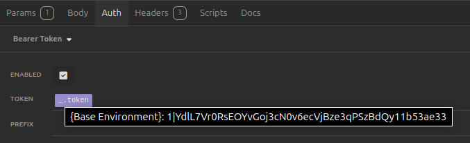

# Gerenciamento de Vendas - Loja Física

## Descrição

Este projeto foi desenvolvido em Laravel 11 com PHP 8.3.6, utilizando o Laravel Sanctum para gerenciamento de tokens de usuário. O sistema foi configurado com Xampp no Linux Ubuntu 22.04 LTS. O objetivo é permitir que funcionários de uma loja física possam gerenciar produtos, clientes e vendas, com a assistência do funcionário que tem acesso ao sistema. Eu optei em colocar o CPF como chave estrangeira nos funcionários (usuários do sistema) para ter a unicidade garantida, visto que é um identificador único no Brasil. Entretanto, achei melhor privar os clientes de colocar dados mais sensíveis como o CPF, então deixei os seus dados mais simplificados para na hora da venda não precisar de várias informações.

## Tecnologias Utilizadas

- **Laravel 11**
- **PHP 8.3.6**
- **Xampp** (Linux Ubuntu 22.04 LTS)
- **Laravel Sanctum** para autenticação de tokens
- **Insomnia** para realizar as requisições API

## Funcionalidades

- **Gerenciamento de Produtos**: CRUD para produtos.
- **Gerenciamento de Clientes**: CRUD para clientes.
- **Gerenciamento de Vendas**: CRUD para vendas, associando produtos e clientes.

## Configuração do Ambiente

### Requisitos

- PHP 8.3.6
- Composer
- Xampp

### Instalação

1. **Clone o repositório**:

    ```bash
    git clone git@github.com:RafaelMoura11/sales-manager-api.git
    cd sales-manager-api
    ```

2. **Instale as dependências do Composer**:

    ```bash
    composer install
    ```

3. **Configure o ambiente**:

   Renomeie o arquivo `.env.example` para `.env`

4. **Gere a chave da aplicação**:

    ```bash
    php artisan key:generate
    ```
   
5. **Configuração do Banco de Dados**:

   Edite o arquivo `.env` com as configurações do seu banco de dados:
    ```env
    DB_CONNECTION=mysql
    DB_HOST=127.0.0.1
    DB_PORT=3306
    DB_DATABASE=sales_manager
    DB_USERNAME=root
    DB_PASSWORD=
    ```

6. **Execute as migrações**:

    ```bash
    php artisan migrate
    ```

7. **Execute os Seeders**:

    ```bash
    php artisan db:seed
    ```

8. **Inicie o Servidor localmente:**:

    ```bash
    php artisan serve
    ```

Lembre-se que o projeto estará rodando localmente na porta 8000

## Endpoints da API

### Autenticação

- **Login** (POST `/api/login`)

É importante lembrar que para acessar todas as rotas da aplicação (exceto a de login), você deve possuir um *bearer token*. E para conseguir um, eu disponibilizei de início um user já cadastrado:

```json
{
  "email": "admin@email.com",
  "password": "admin123"
}
```

Copie o token e envie ele em todas as requisições como um *bearer token*




- **Registrar Usuário** (POST `/api/register`)

```json
{
  "cpf": "12345678900",
  "name": "Nome do Funcionário",
  "email": "email@example.com",
  "password": "senha"
}
```


### Produtos

- **Listar Produtos** (GET `/api/products`)

- **Criar Produto** (POST `/api/products`)

```json
{
  "name": "Produto Exemplo",
  "category": "Categoria",
  "price": 100.00
}
```

- **Atualizar Produto** (PUT `/api/products/{id}`)

```json
{
  "name": "Produto Atualizado",
  "category": "Categoria Atualizada",
  "price": 120.00
}
```

- **Deletar Produto** (DELETE `/api/products/{id}`)


### Clientes

- **Listar Clientes** (GET `/api/customers`)

- **Criar Cliente** (POST `/api/customers`)

```json
{
  "name": "Nome do Cliente",
  "email": "emailcliente@example.com"
}
```

- **Atualizar Cliente** (PUT `/api/customers/{id}`)

```json
{
  "name": "Nome Atualizado",
  "email": "emailclienteatualizado@example.com"
}
```

- **Deletar Cliente** (DELETE `/api/customers/{id}`)


### Vendas

- **Listar Vendas** (GET `/api/sales`)

- **Criar Venda** (POST `/api/sales`)

```json
{
  "user_cpf": "12345678900",
  "customer_id": 1,
  "product_id": 1,
  "quantity": 2,
  "final_price": 300.00
}
```

- **Atualizar Venda** (PUT `/api/sales/{id}`)

```json
{
  "customer_id": 2,
  "product_id": 3,
  "quantity": 3,
  "final_price": 229.97
}
```

- **Deletar Venda** (DELETE `/api/sales/{id}`)


*Desenvolvido por [Rafael Moura]*
